# Part A: Prometheus + Grafana + Alertmanager

## Goal and expected result

- Run docker-compose setup of Prometheus, Grafana, Alertmanager and our application
- Scrap RED metrics from Prometheus and visualize them in Grafana
- Setup alerts and achieve FIRING state in Prometheus and Alertmanager

## Structure

- `docker-compose.yml` - docker-compose setup
- `app` - our server application that will be monitored. It has special `/error` endpoint that will return 500 error always
- `prometheus` - Prometheus server configuration that will be mounted into Prometheus container. It will scrap metrics from our application via `/metrics` endpoint every 15 seconds
- `alertmanager` - Alertmanager configuration that will be mounted into Alertmanager container. It will send alerts to our Echo server for us to see
- `grafana` - Grafana configuration with our Prometheus data source and dashboards that will be mounted into Grafana container
- `load-test` - load-testing script

To simplify running the setup a Makefile was provided.

## Running

```bash
make up
```

After successful image build and container startup the following addresses will be available:

- App: http://localhost:8080
- App metrics: http://localhost:19090/metrics
- Prometheus: http://localhost:9090
- Grafana: http://localhost:3000 (with "RED Demo App" dashboard)
- Alertmanager: http://localhost:9093/#/alerts
- Echo server: http://localhost:8081

To stop the setup run:

```bash
make down
```

## Steps

### 1. Running Docker Compose setup

```bash
make up
```

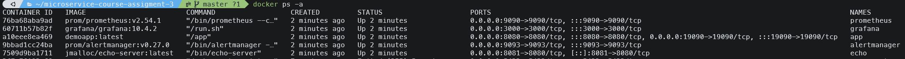

### 2. Opening Grafana

Open http://localhost:3000 in your browser

By default admin/admin credentials are used to login:

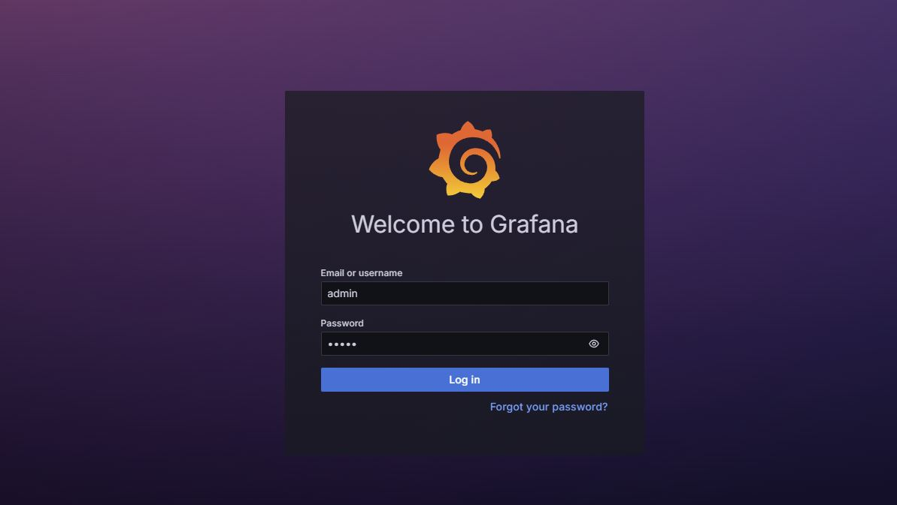

After successful login Grafana will ask you to change the default password. This can be skipped though:

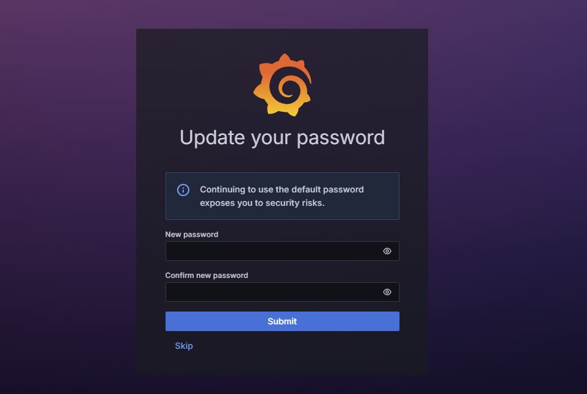

### 3. Data source

As we can see, Prometheus is set as the default data source:

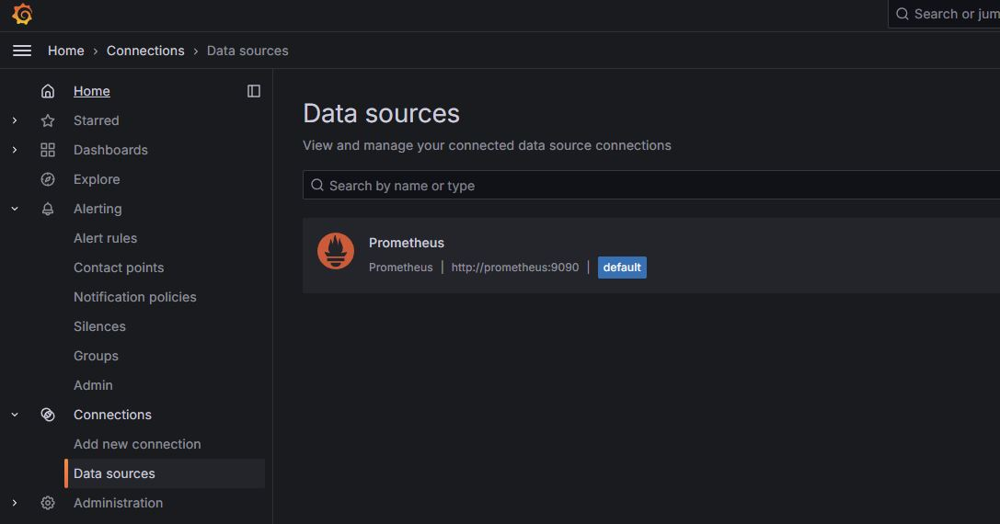

We can also see that Grafana fetched alerts from Prometheus:

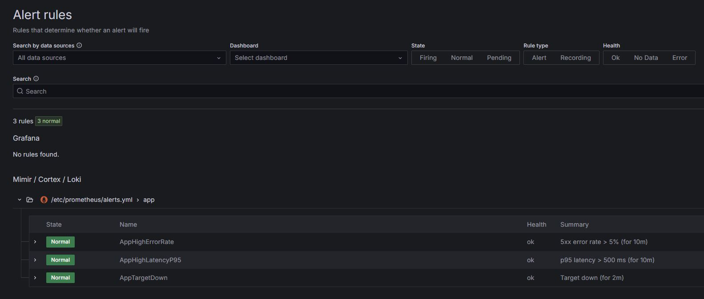

### 4. Grafana Dashboard (Default state)

In the available dashboards we can see that there is only one dashboard called "RED Demo App". Here we can see the metrics from our application.

Which doesn't show much data as we haven't run the load-testing script yet.

It only shows `up` metric which is attached automatically to all targets in Prometheus. `1` if the instance is healthy, i.e. reachable, or `0` if the scrape failed.

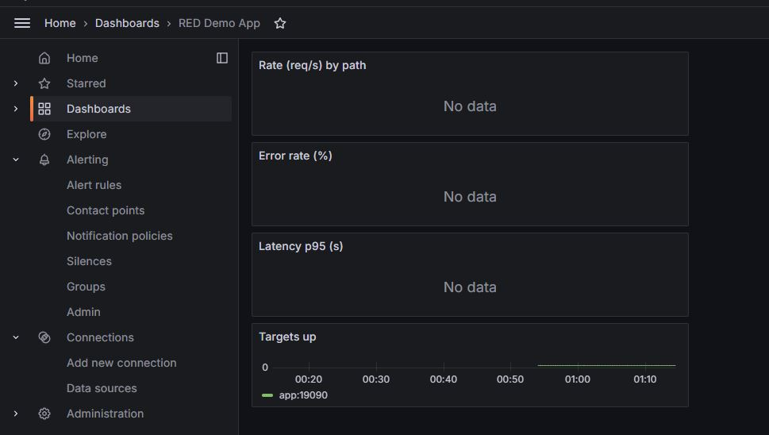

### 5. Prometheus metrics that we scrap

Opening http://localhost:19090/metrics in the browser we can see that Prometheus scraped metrics from our application:

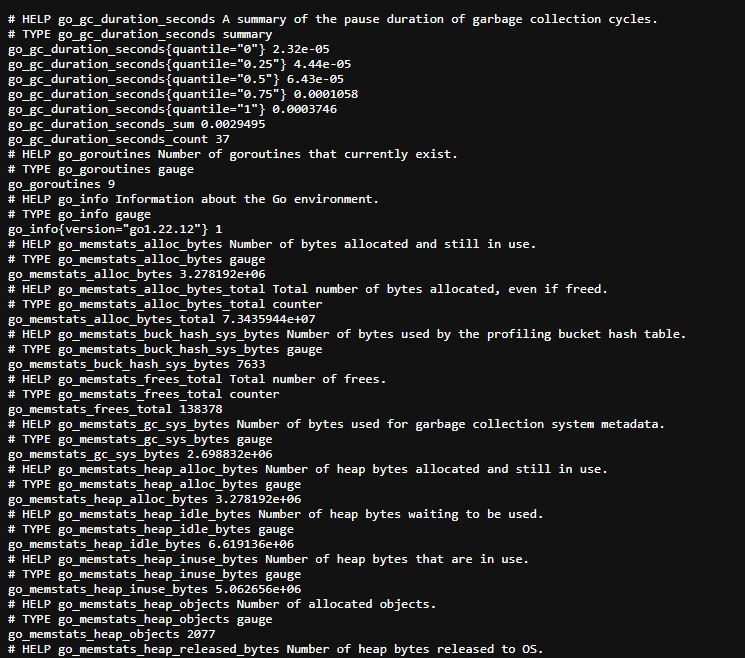

### 6. Prometheus UI

Opening http://localhost:9090 in the browser we can see that Prometheus ui is available:

Here we can see that alerts are setup and not firing yet.

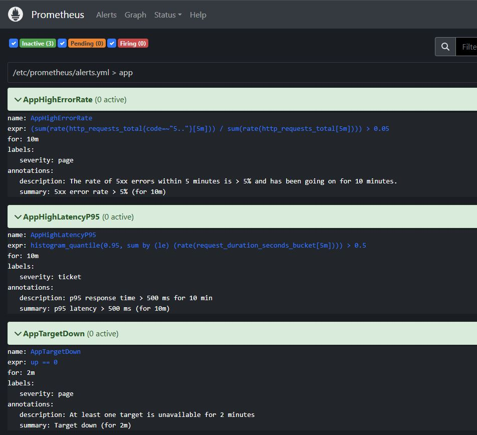

The target is setup as well and it's healthy:

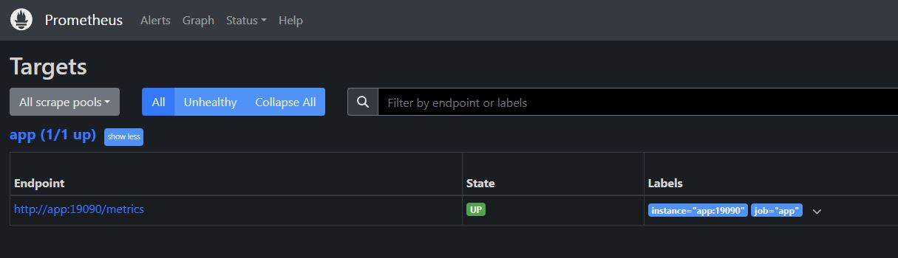

### 7. Running load-testing script (just once)

Now we will generate some load on our application and see how Grafana, Prometheus and Alertmanager will react.

```bash
./load-test/run.sh
```

The load-testing script sends 50 requests to our application and 15 requests to our error endpoint:

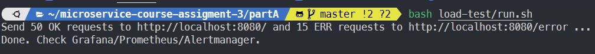

Here we can now see some actual metrics from Prometheus:

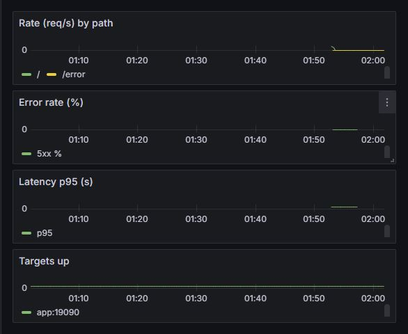

As for alerts, **the window is way too wide** to fire them with running the script just once but we can see that they're in `PENDING` state in both Prometheus:

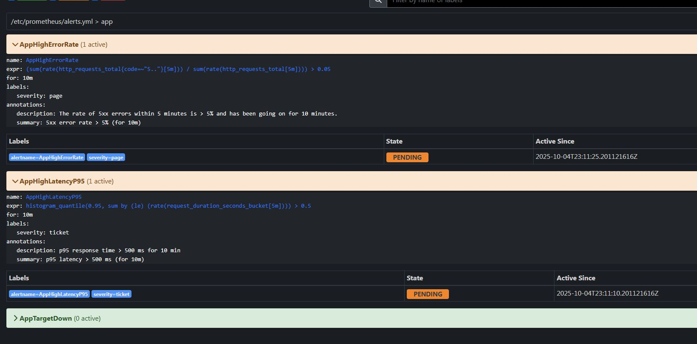

and in Grafana:

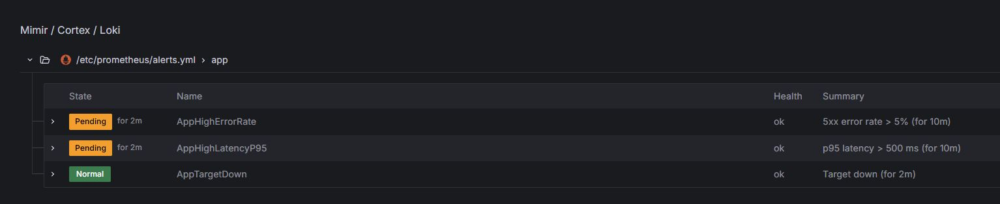

**Alerts enter a `PENDING` state when their rule expression is first evaluated as true. They will only fire if the condition remains true for the entire 10-minute duration. If the expression evaluates to false at any point during this window, the alert reverts to `INACTIVE`.**

## Running load-testing script (infinite loop)

As stated before to actually fire the alerts we need to keep sending requests throughout the 10-minute window.

For this we can use the `load-test/infinite_loop.sh` script which will effectively repeat the load-testing script but doing it infinitely.

```bash
./load-test/infinite_loop.sh
```

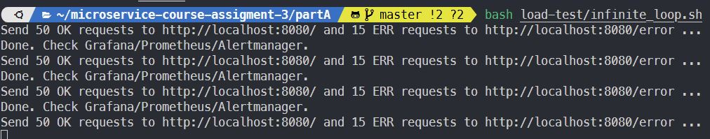

After 10 minutes we can see that the alerts are now in FIRING state in Prometheus:

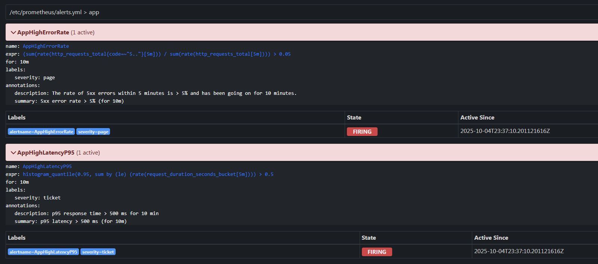

And in Grafana:

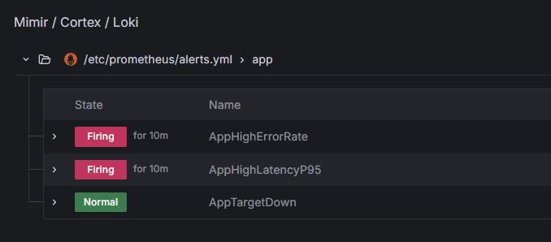

We can also see them in Alertmanager:

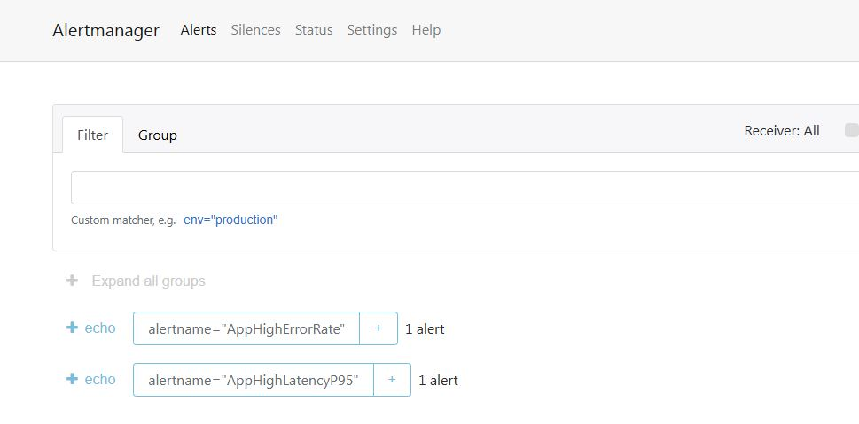

Alertmanager has sent information about the fired alerts to our Echo server which we can see in the logs:

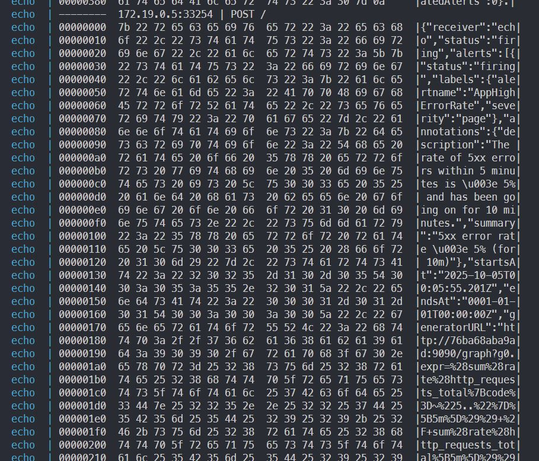


