# Part B: Zabbix (Server + Web + Agent)

## Goal and expected result

- Run docker-compose setup of Zabbix Server, Zabbix Web and Zabbix Agent
- Collect technical metrics
- On your own trigger a problem and log it in Zabbix

## Structure

- `docker-compose.zabbix.yml` - docker-compose setup for Zabbix Server, Zabbix Web, Zabbix Agent and PostgreSQL

## Running

```bash
docker compose -f docker-compose.zabbix.yml up -d
```

## Steps

### 1. Running Docker Compose setup

```bash
docker compose -f docker-compose.zabbix.yml up -d
```

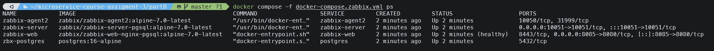

### 2. Zabbix Web

Open http://localhost:8085 in your browser

By default Admin/zabbix credentials are used to login:

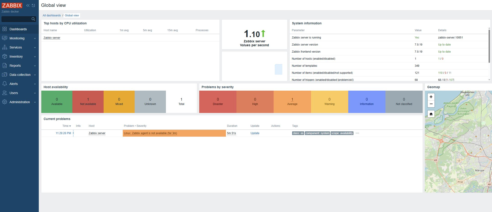

### 3. Creating a host

We need to create a host in Zabbix to collect metrics from our server:

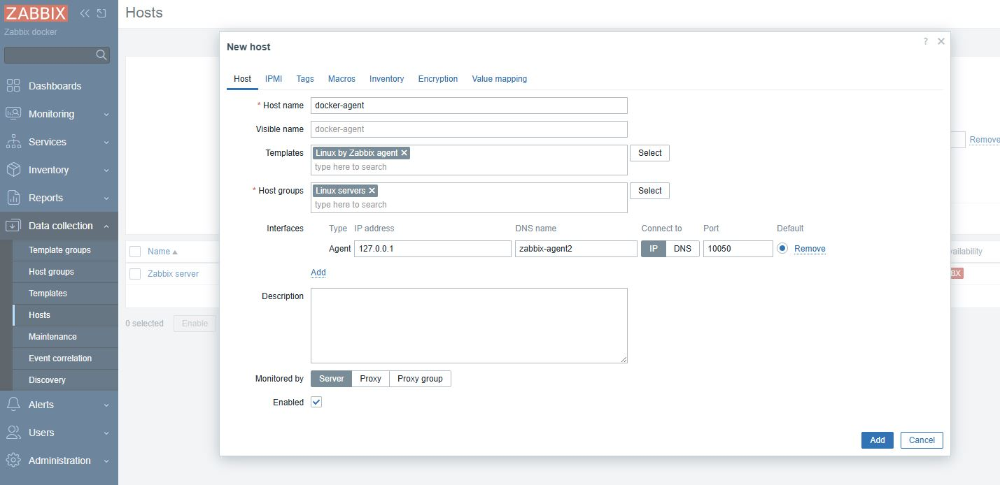

### 4. Host available

After successful creation in a few minutes the host will be available in the list. Green indicator means that the host is available and reachable:

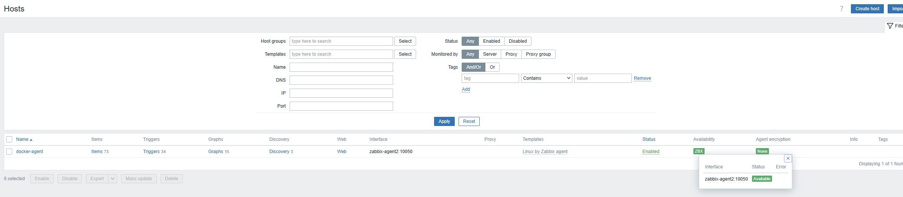

### 5. Metrics

On Monitoring -> Latest data we can already see some metrics:

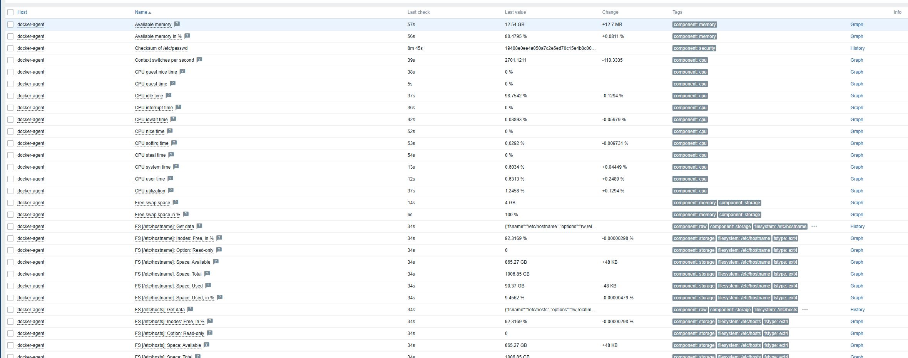

Each metric can be examined in details, graph shows how the metric was changing over time. For example, Available Memory % change for the last 5 minutes:

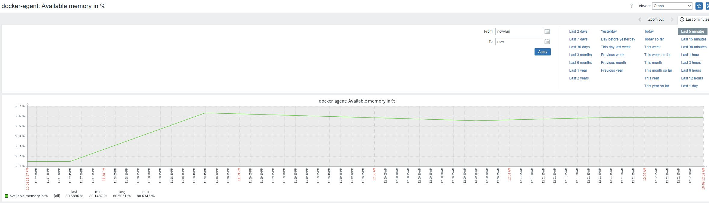

### 6. Graphs

Instead of examining each metric separately we can also see the graphs of all metrics in one place getting an overview of the system. Those were provided by the template that was selected before:

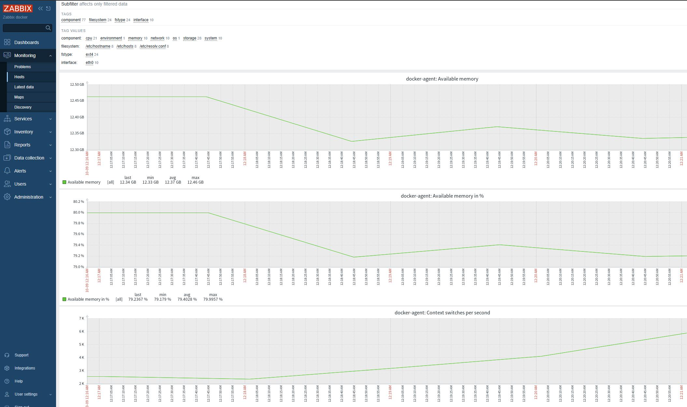

### 7. Triggers

Template that was selected before also provides us with some default triggers. Triggers set thresholds for the metrics and if the metric value is above the threshold the trigger will fire a problem of defined severity:

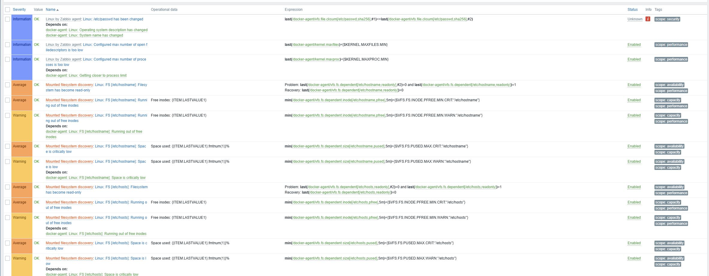

### 8. Triggering a problem

To trigger a problem I **purposely overloaded** the machine that is being monitored. For this purpose I entered the container named `zabbix-agent2` with `exec` and installed `stress` tool. This CLI tool is used for stress testing and can be used to trigger a CPU, IO, RAM spike.

I decided to trigger a RAM spike:

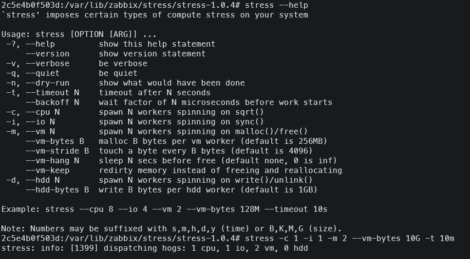

With this, I allocate more than 10 GB of RAM which should be enough to trigger a problem. On the "Latest data" page it's already noticeable that the RAM usage is increasing a lot, taking more than 90% of the available RAM:

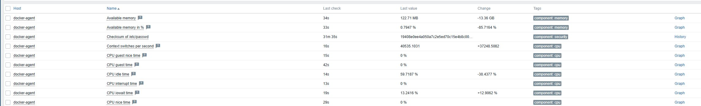

In about 5 minutes the problem was noticed and put in the list of the current problems on the dashboard:

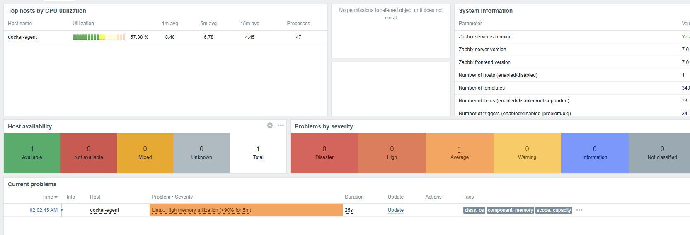

After stopping the stress test tool the problem was resolved after some time:

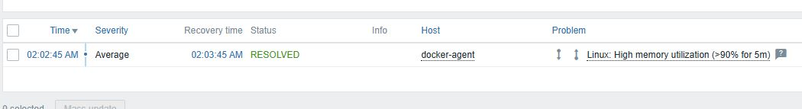

And the RAM usage is back to normal (graph for the last 30 minutes):

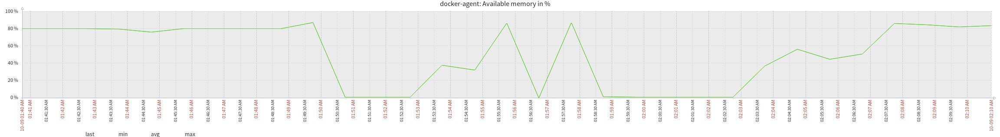
